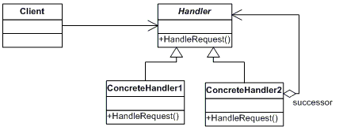

#Chain of Responsibility

A 'Chain of Responsibility' tervezési mintája elkerüli a kérés küldőjének és a fogadójának összekapcsolását azáltal, hogy egynél több objektumnak ad lehetőséget a kérés kezelésére. Ez a minta láncolja a fogadó objektumokat, és továbbítja a kérést a láncon, amíg egy objektum nem kezeli.

