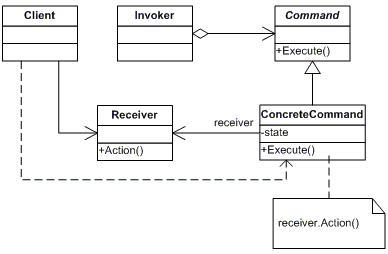

#Command

A 'Command' tervezési minta egy kérést objektumként zár be, ezáltal lehetővé teszi az ügyfelek paraméterezését különböző kérésekkel, sor- vagy naplókérésekkel, és támogatja a visszavonhatatlan műveleteket.

