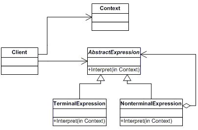

#Interpreter

Adott egy nyelv, az 'Interpreter' tervezési minta egy reprezentációt határoz meg a nyelvtanához, valamint egy tolmácsot, amely a reprezentációt használja a nyelv mondatainak értelmezésére.

