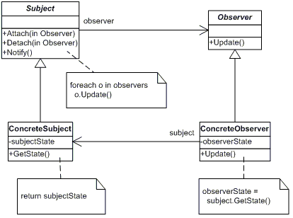

#Observer

Az 'Observer' tervezési mintája egy a többhez függőséget határoz meg az objektumok között, így amikor egy objektum állapota megváltozik, az összes függő értesítést kap és automatikusan frissít.

