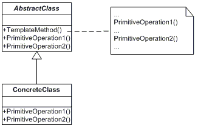

#Template Method

A 'Template Method' tervezési minta meghatározza az algoritmus vázát egy műveletben, néhány lépést alosztályokra halasztva. Ez a minta lehetővé teszi, hogy az alosztályok újradefiniálják az algoritmus bizonyos lépéseit anélkül, hogy megváltoztatnák az algoritmus szerkezetét.

