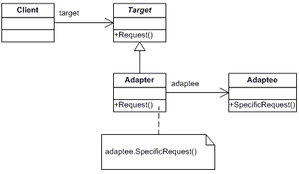

#Adapter

Az 'Adapter' tervezési minta egy átalakító egyik interce ről egy másikra. Ez a tervezési minta lehetővé teszi az osztályok együttdolgozását, amelyek az inkompatibilis interfészek miatt nem tudnának másképp együtt működni.

