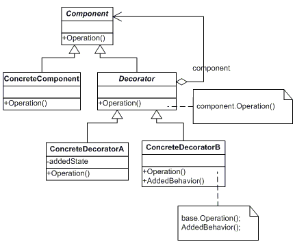

#Decorator

A 'Decorator' tervezési minta dinamikusan további felelősségeket fűz egy objektumhoz. Ez a minta rugalmas alternatívát kínál az alosztályozáshoz a funkcionalitás kiterjesztése érdekében.

